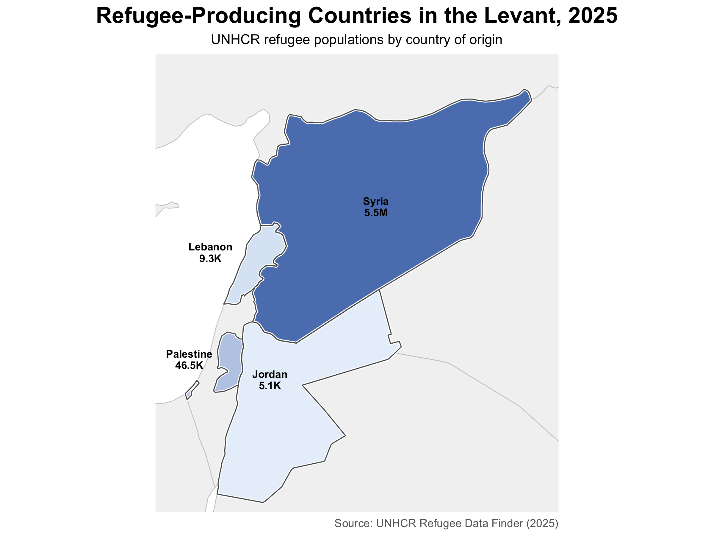
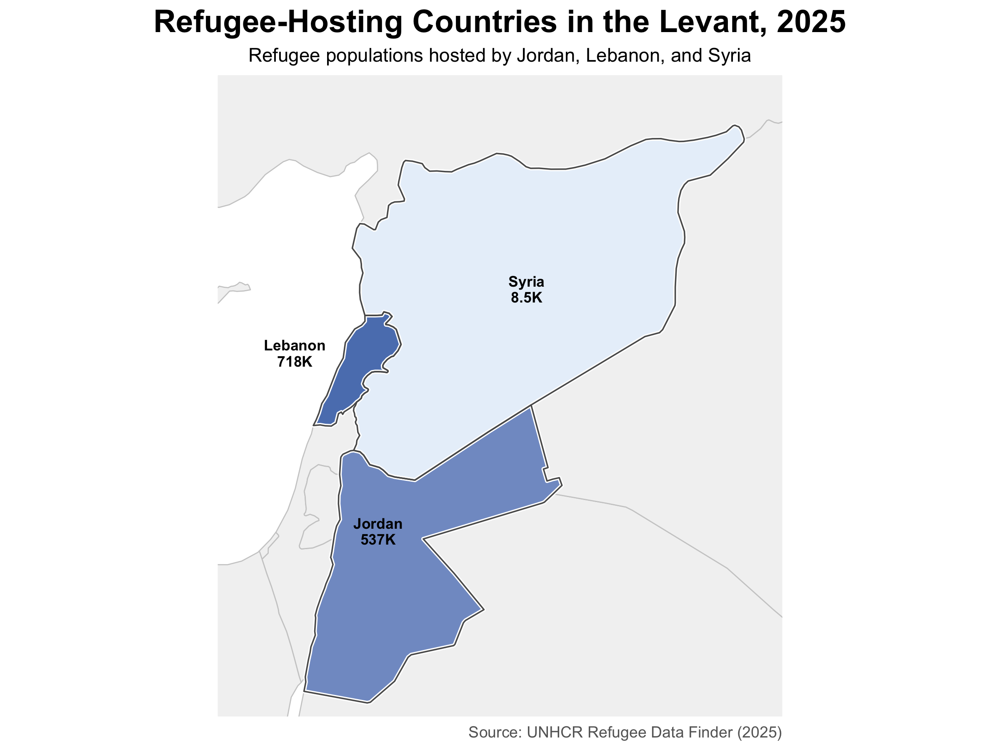

# Refugee Dynamics in the Levant (2025)

## Overview

This project visualizes refugee displacement patterns across the Levant using 2025 UNHCR Refugee Data Finder estimates.

Two complementary maps were created:

1. Refugee-Producing Countries in the Levant
2. Refugee-Hosting Countries in the Levant

Together, these maps illustrate the unequal geography of forced displacement in the Levant. Syria accounts for the overwhelming majority of refugees originating from the region, while Lebanon and Jordan host hundreds of thousands of displaced people despite contributing relatively little to refugee outflows themselves. This contrast underscores the disproportionate responsibility borne by neighboring host countries during protracted displacement crises.

---

## Research Question

How do refugee-producing and refugee-hosting patterns differ across Levant countries in 2025?

---

## Data Source

United Nations High Commissioner for Refugees (UNHCR)

Refugee Data Finder (2025)

Population figures were extracted from the UNHCR Forced Displacement database.

---

## Maps

### Refugee-Producing Countries

This map visualizes refugee populations by country of origin.

Key finding:

- Syria accounts for approximately 5.5 million refugees, reflecting the scale and duration of displacement associated with the Syrian civil war, which has generated one of the largest refugee crises of the 21st century.

---

### Refugee-Hosting Countries

This map visualizes refugee populations hosted by Levant countries.

Key findings:

- Lebanon hosts approximately 718,000 refugees.
- Jordan hosts approximately 537,000 refugees.
- Syria hosts relatively few refugees despite being the largest source country.
- Comparable refugee-hosting data were unavailable for the State of Palestine in the selected UNHCR dataset, illustrating how differences in classification and reporting practices can complicate regional analyses of forced displacement.

---

## Methods

Maps were created in R using:

- sf (spatial data processing)
- ggplot2 (visualization)
- dplyr (data manipulation)
- rnaturalearth (country boundary data)

Country boundaries were obtained through the Natural Earth dataset.

Refugee population estimates were obtained from UNHCR Refugee Data Finder (2025).

---

## Project Files

- `levant_refugees_origin.R`
- `levant_refugees_hostcountry.R`
- `refugee_producing_countries_levant_2025.png`
- `refugee_hosting_countries_levant_2025.png`

---

## Author

Parisa Ayoubi, MPH

Interests: infectious diseases, the impacts of conflict, health inequities, Middle Eastern and North African populations, and spatial epidemiology.